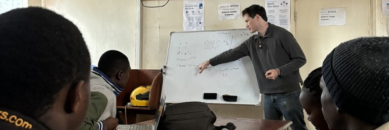

# Programming with Local Impact: Teaching Coding Through Community Service

In 2024, I had the privilege of teaming up with [Shining Hope for Communities Organization (SHOFCO)](https://www.shofco.org/) and the [Georgia Institute of Technology](https://www.gatech.edu/expert/david-joyner-online-education-and-artificial-intelligence-expert) to teach an introductory computer science course at a community computer lab in Kibera, the largest urban slum in Africa. We don't always have electricity or internet, but we do always have a packed classroom of eager students at 20 second-hand computers. I quickly noticed that the "standard" lesson plans I used to learn CS in school weren't as interesting for my students here. Above all else, they are motivated to give back to SHOFCO and their community, and they appreciate problem sets that reflect their desire. Instead of ___ to teach ___, I use ____.